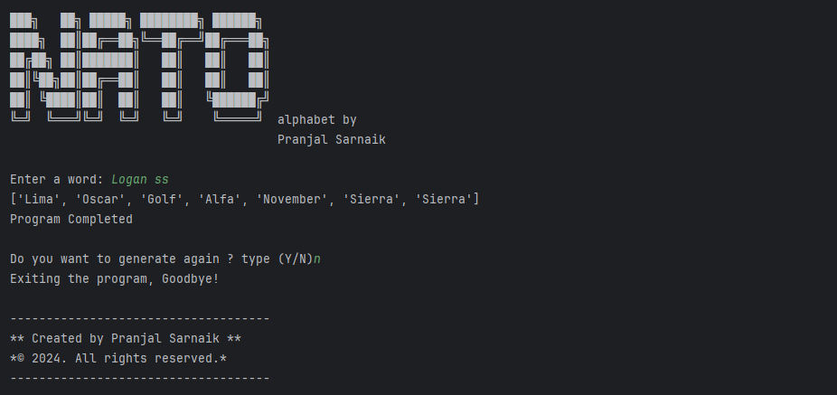

# Nato Alphabet
This program generates a NATO phonetic list for a user-entered word. It reads data from a CSV file, validates input, and uses dictionary comprehension for efficient processing.  

## Screenshots


## Author
Pranjal Sarnaik

## Features
- Generates a NATO phonetic list for user-entered words.  
- Validates user input for correct data entry.  
- Reads and processes data from a CSV file.  
- Allows users to repeat or exit the program interactively.  

## Level
Intermediate

## Tech Stack
Python | Pandas | File Handling | Dictionary Comprehension | Error Handling

## How to Run
1. Clone the repo:  
   ```bash  
   git clone https://github.com/pranjalco/nato-alphabet-intermediate.git

2. Run(Also install required libraries):
    ```bash  
   pip install pandas
   python app.py

**Created by Pranjal Sarnaik**  
*Released under the MIT License*